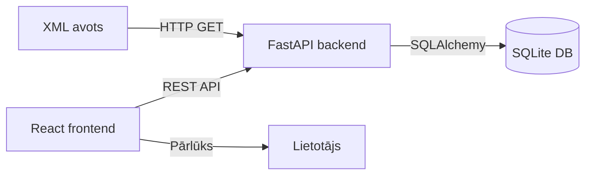
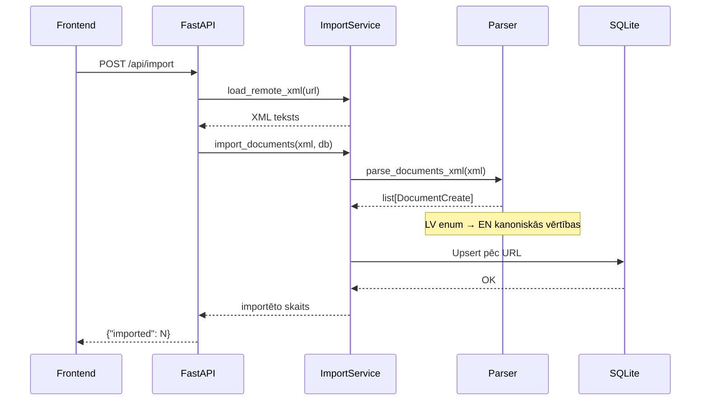
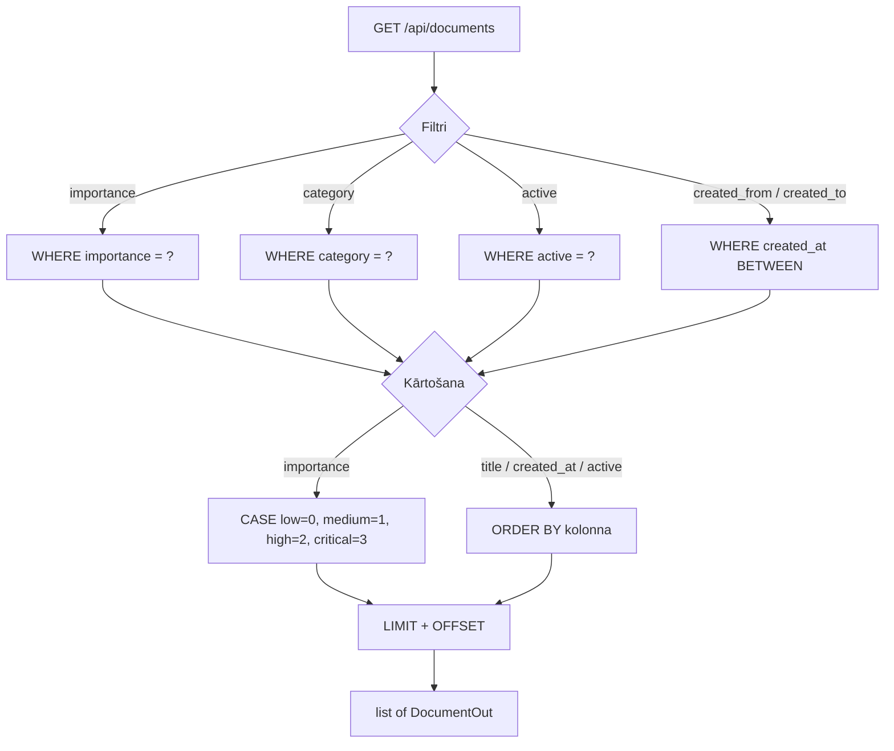

# XML Metadata Service

Dokumentu metadatu importa, glabāšanas un analīzes serviss.

Backend: **FastAPI + SQLAlchemy + SQLite**
Frontend: **React + Vite + TypeScript**

## Ātrais starts

### Backend

```bash
cd backend
python -m venv venv
.\venv\Scripts\Activate        # Windows
pip install -r requirements.txt
uvicorn app.main:app --reload
```

### Frontend

```bash
cd frontend
npm install
npm run dev
```

Atvērt http://localhost:5173

### Testa datu ģenerēšana

```bash
cd backend
python scripts/generate_xml.py -n 50 --seed 123
```

### Testu palaišana

```bash
cd backend
python -m pytest tests/ -v
```

---

## API

### POST /api/import

Importē dokumentus no attālā XML avota datubāzē.

```bash
curl -X POST http://localhost:8000/api/import
# {"imported": 50}
```

### GET /api/documents

Atgriež dokumentu sarakstu ar filtrēšanu, kārtošanu un lapošanu.

#### Vaicājuma parametri

| Parametrs     | Tips   | Noklusējums  | Apraksts                                 |
|---------------|--------|--------------|------------------------------------------|
| importance    | string | —            | Filtrs: `low`, `medium`, `high`, `critical` |
| category      | string | —            | Filtrs: `public`, `internal`, `restricted`, `confidential` |
| active        | bool   | —            | Filtrs: `true` / `false`                 |
| created_from  | string | —            | Filtrs: sākuma datums (`YYYY-MM-DD`)     |
| created_to    | string | —            | Filtrs: beigu datums (`YYYY-MM-DD`)      |
| sort          | string | `created_at` | Kārtošanas lauks: `created_at`, `title`, `importance`, `active` |
| order         | string | `desc`       | Kārtošanas secība: `asc` / `desc`        |
| limit         | int    | 50           | Rezultātu skaits lapā (1–200)            |
| offset        | int    | 0            | Lapošanas nobīde                         |

#### Piemēri

```bash
# Visi dokumenti, jaunākie vispirms (noklusējums)
curl "http://localhost:8000/api/documents"

# Filtrēt pēc kategorijas un datumu diapazona
curl "http://localhost:8000/api/documents?category=internal&created_from=2024-01-01&created_to=2024-12-31"

# Kārtot pēc svarīguma (loģiskā secība: low → medium → high → critical)
curl "http://localhost:8000/api/documents?sort=importance&order=desc"

# Tikai aktīvie kritiskie dokumenti
curl "http://localhost:8000/api/documents?importance=critical&active=true"

# Lapošana
curl "http://localhost:8000/api/documents?limit=10&offset=20"
```

#### Svarīguma kārtošana

Kārtošana pēc `importance` izmanto loģisko prioritātes secību, nevis alfabētisko:

```
low (0) < medium (1) < high (2) < critical (3)
```

Tas nodrošina, ka `?sort=importance&order=desc` atgriež kritiskos dokumentus pirmajā vietā.

---

## Arhitektūra

### Sistēmas pārskats



### Datu importa plūsma



### Vaicājuma apstrādes plūsma



---

## Projekta struktūra

```
backend/
  app/
    main.py              # FastAPI lietotne + dzīves cikls
    routes.py            # API galapunkti
    models.py            # SQLAlchemy dokumenta modelis
    schemas.py           # Pydantic shēmas
    parser.py            # XML parsēšana + LV→EN kartēšana
    import_service.py    # Attālā ielāde + DB upsert
    db.py                # SQLite dzinējs + sesija
  scripts/
    generate_xml.py      # Testa datu ģenerators
  tests/
    test_parser.py       # Parsera vienībtesti
    test_api.py          # API integrācijas testi
  data/
    documents.xml        # Ģenerētie XML testa dati

frontend/
  src/
    App.tsx              # Galvenā UI komponente
    api.ts               # API klients
    App.css              # Stili
```
